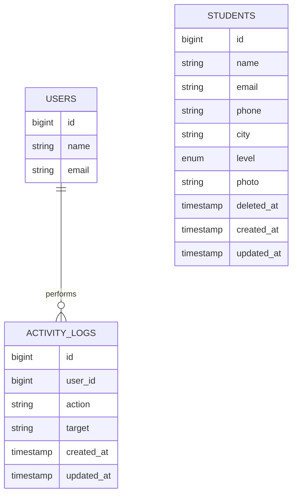

# EduTrack - Student Management System

EduTrack is a Laravel 12 student management application for Sup'ISI. It gives administrators an authenticated workspace for managing student records, searching and filtering by level, exporting lists, and reviewing changes through an activity log.

The application uses Laravel Breeze for authentication and Bootstrap 5.3 via CDN for a clean, consistent interface. Student records support profile photos, validation, pagination, soft deletes, restore, and permanent deletion.

## Tech Stack

| Layer | Technology |
| --- | --- |
| Framework | Laravel 12 |
| Language | PHP 8.2+ |
| Database | MySQL |
| CSS | Bootstrap 5.3 CDN |
| Icons | Bootstrap Icons CDN |
| Authentication | Laravel Breeze |

## Features

- Public home page with total, beginner, intermediate, and advanced student stats.
- Public about page with project context and tech stack.
- Breeze authentication with protected student and activity routes.
- Full student CRUD with route model binding.
- Server validation on create and update forms.
- Search by name, email, or city.
- Level filter dropdown.
- Paginated student list with `paginate(10)`.
- Student detail page with formatted dates and colored level badges.
- Optional student photo upload through the public storage disk.
- Soft delete trash with restore and permanent delete.
- CSV export for active students.
- Activity log for create, update, delete, restore, force delete, and export actions.
- Bootstrap 5 CDN layout with EduTrack primary color `#6600AA`.

## Database Schema (ER Diagram)



## Project Structure

```text
app/
  Http/Controllers/
    ActivityLogController.php
    PageController.php
    StudentController.php
  Models/
    ActivityLog.php
    Student.php
database/
  migrations/
    2026_05_17_012400_create_students_table.php
    2026_05_17_012500_create_activity_logs_table.php
  seeders/
    DatabaseSeeder.php
    StudentSeeder.php
resources/views/
  layouts/app.blade.php
  home.blade.php
  about.blade.php
  students/
    index.blade.php
    create.blade.php
    show.blade.php
    edit.blade.php
    trash.blade.php
  activity-logs/index.blade.php
  auth/
    login.blade.php
    register.blade.php
routes/
  web.php
```

## Installation

1. Clone or copy the project into `C:\xampp\htdocs\edutrack`.
2. Run `composer install`.
3. Copy `.env.example` to `.env` if needed.
4. Set the database values:

```env
DB_CONNECTION=mysql
DB_HOST=127.0.0.1
DB_PORT=3306
DB_DATABASE=edutrack
DB_USERNAME=root
DB_PASSWORD=
```

5. Run `php artisan key:generate`.
6. Create a MySQL database named `edutrack` in phpMyAdmin with `utf8mb4_unicode_ci` collation.
7. Import the provided SQL file in phpMyAdmin when submitting from an exported database.
8. For a fresh local setup, run `php artisan migrate`.
9. Run `php artisan db:seed --class=StudentSeeder`.
10. Run `php artisan storage:link`.
11. Start the app with `php artisan serve`.
12. Open `http://127.0.0.1:8000`.

## Screenshots

- Home page
- Students list
- Add Student form
- Student detail page
- Edit form
- Trash
- Activity Log
- Login page

## Checklist

- [x] `/`, `/about`, and `Route::resource('students', StudentController::class)`.
- [x] `PageController` with `home()` stats and `about()`.
- [x] `StudentController` resource methods.
- [x] Route model binding in show, edit, update, and destroy.
- [x] Master layout with navbar, flash messages, and footer.
- [x] Home stat cards.
- [x] Student table with `@forelse` and `$loop->iteration`.
- [x] Create and edit forms with CSRF, `old()`, `@error`, and `is-invalid`.
- [x] Student detail view.
- [x] Migration and model fillable fields.
- [x] StudentSeeder with 10 Moroccan students.
- [x] Store and update validation.
- [x] Delete form with `@method('DELETE')` and confirmation.
- [x] Flash messages on create, update, and delete.
- [x] Search, level filter, pagination, and enriched show page.
- [x] Photo uploads, soft deletes, CSV export, activity log, Breeze auth, and Bootstrap CDN styling.

## Author

Your name - Sup'ISI, Tétouan
